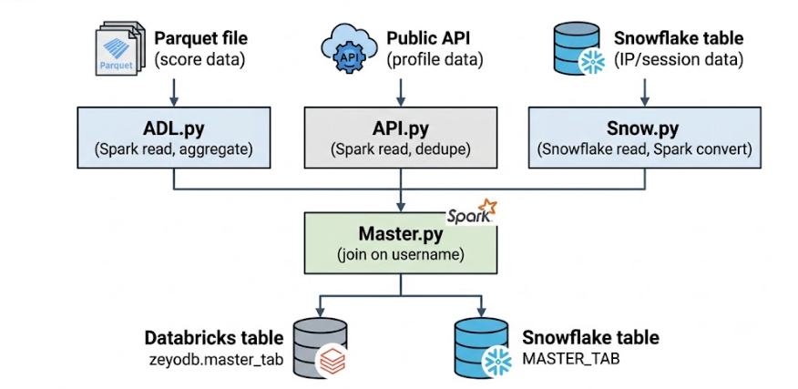
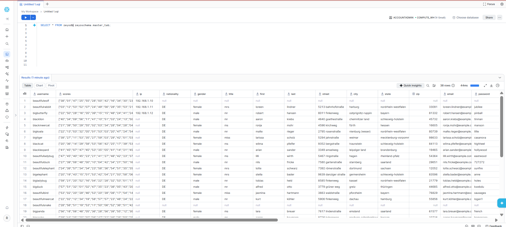

# Spark-databricks-snowflake-pipeline

An end-to-end data pipeline that pulls user data from three different sources,
joins it into one table, and writes the result to both Databricks and Snowflake.
Built to practice integrating PySpark, Databricks, and Snowflake.

## Architecture


Each source is read and saved as its own table, then `Master.py` joins all
three on `username` and writes the combined result to both Databricks and
Snowflake.

## Problem statement

Organizations often store data across multiple sources and platforms, such as Parquet files, external APIs, and cloud data warehouses like Snowflake. Managing these data sources independently makes it difficult to combine information, maintain consistency, and generate a unified dataset for analytics.

The objective of this project is to build an end-to-end data engineering pipeline using PySpark, Databricks, and Snowflake that can ingest data from multiple heterogeneous sources, process and transform the data, and integrate the datasets into a unified view.

The pipeline reads structured data from Parquet files, retrieves additional information from an external API, and extracts data from Snowflake. PySpark is then used for data processing and transformation, while Databricks provides the processing environment. The datasets are joined using a common business key such as username and the resulting integrated data is made available for downstream analytics.

The project demonstrates how a data engineer can build a scalable pipeline that addresses common real-world challenges such as multi-source data ingestion, data transformation, schema handling, data integration, and cloud-based data processing.

## 📊 Data Sources

| Source | Project File |
|--------|--------------|
| 📁 Parquet Dataset | [data.parquet](https://github.com/royal-eternity/spark-databricks-snowflake-pipeline/blob/main/data.parquet) |
| 🔌 External API | [API.py](https://github.com/royal-eternity/spark-databricks-snowflake-pipeline/blob/main/API.py) |
| ❄️ Snowflake | [Snow.py](https://github.com/royal-eternity/spark-databricks-snowflake-pipeline/blob/main/Snow.py) |
| 🔄 Master Integration Pipeline | [Master.py](https://github.com/royal-eternity/spark-databricks-snowflake-pipeline/blob/main/Master.py) |

## Pipeline Explanation

This project implements an end-to-end data integration pipeline using PySpark, Databricks, and Snowflake.

The pipeline follows these steps:

1. Data Ingestion → Data is collected from a Parquet file, external API, and Snowflake.

2. Data Processing → The ingested data is loaded into PySpark DataFrames for processing and transformation.

3. Data Transformation → The datasets are cleaned and prepared into a consistent structure.

4. Data Integration → Data from the different sources is joined using the common username field.

5. Databricks Processing → PySpark jobs are executed in the Databricks environment for scalable data processing.

6. Final Output → The integrated data is produced as a unified dataset for downstream analysis and data processing.

Overall Flow:

Parquet + API + Snowflake → PySpark → Transformation → Join → Databricks → Unified Dataset


## Tech used

- PySpark
- Databricks (Free Edition)
- Snowflake (free trial)
- Unity Catalog volumes for file storage
- Snowflake Python connector (Databricks Free Edition's Serverless compute
  doesn't include the Spark-Snowflake JDBC driver, so the Python connector +
  pandas is used instead)

## Setup

You'll need:
- A free Databricks account ([databricks.com/try-databricks](https://databricks.com/try-databricks) - Community/Free Edition)
- A free Snowflake trial account ([signup.snowflake.com](https://signup.snowflake.com))

### 1. Snowflake

Create a database, schema, and a source table to represent the IP/session data:

```sql
CREATE DATABASE IF NOT EXISTS zeyodb;
CREATE SCHEMA IF NOT EXISTS zeyodb.zeyoschema;

CREATE OR REPLACE TABLE zeyodb.zeyoschema.snow_source (
    username STRING,
    ip STRING
);

INSERT INTO zeyodb.zeyoschema.snow_source VALUES
('sample_user1', '192.168.1.10'),
('sample_user2', '192.168.1.11');
```

Use real usernames that also exist in your parquet file, or the join in
`Master.py` will return no rows.

### 2. Databricks

1. Upload `data.parquet` to a Unity Catalog volume
   (**New -> Add or upload data -> Upload files to a volume**), and copy the
   resulting path.
2. Import the four notebooks (ADL.py, API.py, Snow.py, Master.py) into your workspace
3. In `ADL.py`, replace the parquet path with the one you copied.
4. In `Snow.py` and `Master.py`, replace `<your_snowflake_account>` and
   `<your_snowflake_username>` with your own Snowflake account identifier and
   username.
5. Run the notebooks in this order: `ADL.py` -> `API.py` -> `Snow.py` -> `Master.py`.
6. `Snow.py` and `Master.py` will prompt for a `snowflake_password` widget at
   the top of the notebook when run - enter your Snowflake password there.
   It is never stored in the code.

## Sample output
The final data was successfully loaded into Snowflake and validated using SQL queries.





## Planned improvements

This is a working pipeline, not a production system. With more time I'd add:

- A proper bronze/silver/gold layering structure with a data quality layer
  (null checks, duplicate checks, schema validation) between stages
- Automated scheduling via a Databricks Job instead of running notebooks manually
- Logging instead of print statements
- Basic unit tests for the transformation logic
- Spark performance tuning (partitioning, broadcast joins) once the data
  volume is large enough to need it
